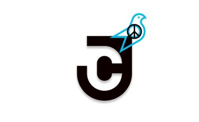
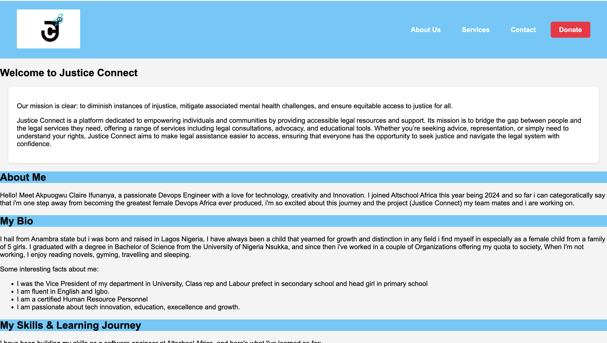
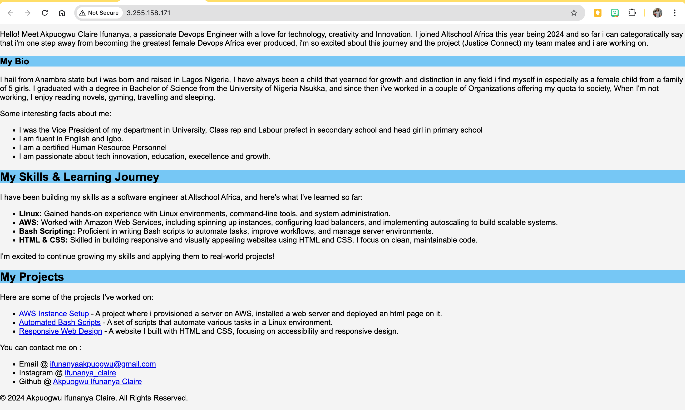

# Altschool-second-semester-project
## Provisioning the Server
1. **I Created an EC2 instance on AWS with Ubuntu**:
   - Firstly i logged into my AWS Management Console.
   - Then created a new EC2 instance using **Ubuntu 22.04 LTS** as the operating system.
   - After which i chose an instance type (`t2.micro`).
   - Created a new **security group** allowing inbound HTTP traffic on port 80.
   - I already had a private key saved so i just used that one to proceed.

2. **Connected to the EC2 instance via SSH**:
   - Opened my terminal and ran the following command to SSH into the EC2 instance:
     ```bash
     ssh -i "demo-keypair1.pem" ubuntu@18.202.253.7
     ```

---

## Web Server Setup
1. **Installed Apache Web Server**:
   - Once i connected to the EC2 instance, ran the following command to install Apache2:
     ```bash
     sudo apt update
     sudo apt install apache2 -y
     ```
   - This installs the apache2 HTTP server, which serves your web content.

2. **Ensured HTTP traffic on port 80 was allowed**:
   - Next step was to configure the **Security Group** in the AWS Management Console to allow inbound HTTP traffic on port 80 for the EC2 instance.
   - Checked the firewall settings using the following command:
     ```bash
     sudo ufw allow 80/tcp
     sudo ufw allow 443/tcp
     sudo ufw enable
     ```

---

## HTML Page Deployment
1. **Created a simple `index.html` file with the following content**:
   - For this i used the `nano` editor to create an HTML page at `/var/www/html`:
     ```bash
     sudo nano /var/www/html/index.html
     ```
   - The content of `index.html` included:
     ```html
     <!DOCTYPE html>
     <html lang="en">
    <head>
    <meta charset="UTF-8">
    <meta name="viewport" content="width=device-width, initial-scale=1.0">
    <title>Justice Connect</title>
    <style>
        body {
            font-family: Arial, sans-serif;
            background-color: #f4f4f4;
            margin: 0;
            padding: 0;
            
        }
        header {
            background-color: #76c7f7;
            color: rgb(11, 10, 10);
            padding: 10px 0;
        }
        .content {
            margin: 20px;
            padding: 20px;
            background-color: #fff;
            border-radius: 8px;
            box-shadow: 0 2px 4px rgba(0, 0, 0, 0.1);
        }
        h2,h3{
            background-color: #76c7f7; 
        }
   .site-header {
    display: flex;
    justify-content: space-between;
    align-items: center;
    padding: 20px 40px;
    background-color:  #76c7f7; /* Justice Connect's signature blue color */
    color: #fff;
}

.logo-container .logo {
    width: 150px;
    height: auto;
}

.navigation .nav-links {
    list-style: none;
    display: flex;
    gap: 20px;
    margin: 0;
    padding: 0;
}

.nav-links li {
    display: inline;
}

.nav-links a {
    text-decoration: none;
    color: #fff;
    font-weight: bold;
    padding: 10px 15px;
    border-radius: 5px;
    transition: background-color 0.3s;
}

.nav-links a:hover {
    background-color: #0066cc;
    color: #fff;
}

.nav-links .cta {
    background-color: #e63946; /* Highlight the Call-to-Action */
    color: #fff;
    padding: 10px 20px;
    border-radius: 5px;
    </style>

</head>
<body>
   <header class="site-header">
        <div class="logo-container">
            
        </div>
        <nav class="navigation">
            <ul class="nav-links">
                <li><a href="#about">About Us</a></li>
                <li><a href="#services">Services</a></li>
                <li><a href="#contact">Contact</a></li>
                <li><a href="#donate" class="cta">Donate</a></li>
            </ul>
        </nav>
    </header>
<section>
    <h1>Welcome to Justice Connect</h1>
</section>

<section class="content">
    <p>Our mission is clear: to diminish instances of injustice, mitigate associated mental health challenges, and ensure equitable access to justice for all.</p>
    <p>Justice Connect is a platform dedicated to empowering individuals and communities by providing accessible legal resources and support. Its mission is to bridge the gap between people and the legal services they need, offering a range of services including legal consultations, advocacy, and educational tools. Whether you’re seeking advice, representation, or simply need to understand your rights, Justice Connect aims to make legal assistance easier to access, ensuring that everyone has the opportunity to seek justice and navigate the legal system with confidence.</p>
</section>

<section>
    <h2>About Me</h2>
    <p>Hello! Meet Akpuogwu Claire Ifunanya, a passionate Devops Engineer with a love for technology, creativity and Innovation. I joined Altschool Africa this year being 2024 and so far i can categoratically say that i'm one step away from becoming the greatest female Devops Africa ever produced, i'm so excited about this journey and the project (Justice Connect) my team mates and i are working on.</p>


    <h3>My Bio</h3>
    <p>I hail from Anambra state but i was born and raised in Lagos Nigeria, I have always been a child that yearned for growth and distinction in any field i find myself in especially as a female child from a family of 5 girls. I graduated with a degree in Bachelor of Science from the University of Nigeria Nsukka, and since then i've worked in a couple of Organizations offering my quota to society, When I'm not working, I enjoy reading novels, gyming, travelling and sleeping.</p>

    <p>Some interesting facts about me:
        <ul>
            <li>I was the Vice President of my department in University, Class rep and Labour prefect in secondary school and head girl in primary school</li>
            <li>I am fluent in English and Igbo.</li>
            <li>I am a certified Human Resource Personnel</li>
            <li>I am passionate about tech innovation, education, execellence and growth.</li>
        </ul>
    </p>
</section>

<section id="skills">
    <h2>My Skills & Learning Journey</h2>
    <p>I have been building my skills as a software engineer at Altschool Africa, and here's what I've learned so far:</p>
    <ul>
        <li><strong>Linux:</strong> Gained hands-on experience with Linux environments, command-line tools, and system administration.</li>
        <li><strong>AWS:</strong> Worked with Amazon Web Services, including spinning up instances, configuring load balancers, and implementing autoscaling to build scalable systems.</li>
        <li><strong>Bash Scripting:</strong> Proficient in writing Bash scripts to automate tasks, improve workflows, and manage server environments.</li>
        <li><strong>HTML & CSS:</strong> Skilled in building responsive and visually appealing websites using HTML and CSS. I focus on clean, maintainable code.</li>
    </ul>
    <p>I'm excited to continue growing my skills and applying them to real-world projects!</p>
</section>

<section id="projects">
    <h2>My Projects</h2>
    <p>Here are some of the projects I've worked on:</p>
    <ul>
        <li><a href="http://3.255.158.171/" target="_blank">AWS Instance Setup</a> - A project where i provisioned a server on AWS, installed a web server and deployed an html page on it.</li>
        <li><a href="https://github.com/Clairebasil/Bash-learning" target="_blank">Automated Bash Scripts</a> - A set of scripts that automate various tasks in a Linux environment.</li>
        <li><a href="https://clairebasil-first-semester.netlify.app/" target="_blank">Responsive Web Design</a> - A website I built with HTML and CSS, focusing on accessibility and responsive design.</li>
    </ul>
</section>


<footer>
    <p>You can contact me on : </p>
    <ul>
        <li>Email @ <a href="mailto:ifunanyaakpuogwu@gmail.com" target="_blank">ifunanyaakpuogwu@gmail.com</a> </li>
        <li>Instagram @ <a href="https://www.instagram.com/ifunanya_claire" target="_blank">ifunanya_claire</a></li>
        <li>Github @ <a href="https://github.com/ifunanya-claire" target="_blank">Akpuogwu Ifunanya Claire</a></li>

    </ul>
    <p>&copy; 2024 Akpuogwu Ifunanya Claire. All Rights Reserved.</p>
</footer>


    </body>
</html>
     ```

2. **Deployed the HTML page**:
   - Saved the `index.html` file in the `/var/www/html` directory.
     

---

## Networking
1. **Configured Security Group to Allow HTTP Traffic on Port 80**:
   - In the AWS Management Console, I updated the security group to allow inbound HTTP traffic on port 80 from all IP addresses (`0.0.0.0/0`).

2. **Public IP**: 
   - The public IP of the server is `18.202.253.7`, which allows users to access the HTML page by navigating to:
     ```bash
     http://<18.202.253.7>
     ```
   - This page can be accessed from any web browser using the EC2 instance's public IP address.

---

## HTTPS Configuration 
1. **Installed Certbot and Obtained a Free SSL Certificate from Let's Encrypt**:
   - Installed Certbot and the Apache plugin:
     ```bash
     sudo apt install certbot python3-certbot-nginx -y
     ```
   - Ran the following command to request an SSL certificate from Let’s Encrypt:
     ```bash
     sudo certbot --nginx
     ```
   - Followed the prompts to configure the SSL certificate for my domain (www.ifunanyaclaire.com).

2. **Configured Apache to Serve the Site Over HTTPS**:
   - Once the SSL certificate was successfully obtained, Apache was automatically configured to serve the website over HTTPS.
   - Verified the site could now be accessed securely using HTTPS:
     ```bash
     https://www.ifunanyaclaire.com
     ```
   - The site now loads with a secure connection (`https://`).

---

## Deliverables

### 1. IP Address
The server can be accessed using the following IP address:

**`18.202.253.7`**  

[Access via IP Address](http://18.202.253.7)
### 2. Domain Name
The domain name associated with this project is:

**`www.ifunanyaclaire.com`**  

[Access via Domain Name](https://www.ifunanyaclaire.com)

---

## Screenshots
- **Screenshot 2&3**: Showcasing the website running on my browser which i used the code below to send the screenshot from my local machine to my EC2 instance.
  ```bash
  scp -i ~/.ssh/id_ed25519 ~/Desktop/screenshot2.png ubuntu@18.202.253.7:/home/ubuntu/
  ```
 



---

## Conclusion
This document details the steps i took to provision an AWS EC2 instance, install Nginx, deploy my Justice-connect landing page, configure networking, and enableD HTTPS for the server. With these steps, my Justice-connect landing page is now publicly accessible from any browser using the instance’s public IP.

